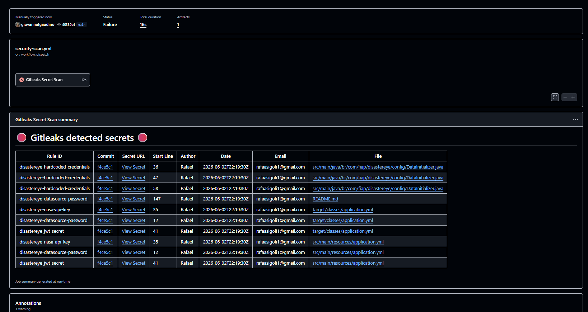

# 🛰️ DisasterEye API

> **Plataforma de Prevenção de Desastres Naturais via Satélites NASA**  
> FIAP — 3ESPR — 2026 | ODS 9 — Indústria, Inovação e Infraestrutura  
> Disciplina: Arquitetura Orientada a Serviço (SOA)

---
## Integrantes
- Giovanna Franco Gaudino Rodrigues RM553701 
- Rafael de Almeida Sigoli RM554019
- Rafael Jorge Del Padre RM552765
---

## 📌 Problema Abordado

Desastres naturais como incêndios, inundações, deslizamentos e tempestades causam perdas humanas e econômicas significativas, especialmente em países como o Brasil. A falta de sistemas integrados de alerta precoce agrava o problema.

O **DisasterEye** resolve isso integrando dados de satélites da NASA (EONET) com uma plataforma de alertas em tempo real, permitindo que autoridades e cidadãos recebam informações sobre riscos em sua região com base em coordenadas geoespaciais.

---

## 🏗️ Arquitetura da Solução


https://mermaid.ai/d/4d19985a-62ed-42ba-99e6-dac209844a54
```
┌─────────────────────────────────────────────────────────────┐
│                     CLIENTES                                │
│         App Mobile    │    Web Dashboard    │    Admin UI   │
└──────────────┬─────────────────────────────────────────────┘
               │ HTTPS + JWT
┌──────────────▼──────────────────────────────────────────────┐
│                  DisasterEye API (Spring Boot)               │
│                                                             │
│  ┌──────────────┐  ┌──────────────┐  ┌──────────────────┐  │
│  │ AuthController│  │AlertController│  │NasaEonetController│  │
│  │  /auth/**    │  │ /alerts/**   │  │   /nasa/**       │  │
│  └──────┬───────┘  └──────┬───────┘  └────────┬─────────┘  │
│         │                 │                   │             │
│  ┌──────▼───────┐  ┌──────▼───────┐  ┌────────▼─────────┐  │
│  │  AuthService │  │AlertService  │  │ NasaEonetService  │  │
│  └──────┬───────┘  └──────┬───────┘  └────────┬─────────┘  │
│         │                 │                   │             │
│  ┌──────▼─────────────────▼───────┐  ┌────────▼─────────┐  │
│  │        JPA Repositories        │  │  RestTemplate    │  │
│  └──────────────┬─────────────────┘  └────────┬─────────┘  │
│                 │                             │             │
│  ┌──────────────▼──────┐          ┌───────────▼──────────┐  │
│  │   H2 / PostgreSQL   │          │    NASA EONET API    │  │
│  │     (banco de       │          │  eonet.gsfc.nasa.gov │  │
│  │      dados)         │          └──────────────────────┘  │
│  └─────────────────────┘                                   │
│                                                             │
│  ┌─────────────────────────────────────────────────────┐   │
│  │  Security Layer: JWT Filter → Spring Security       │   │
│  │  Observability: Actuator + Structured Logs + MDC    │   │
│  └─────────────────────────────────────────────────────┘   │
└─────────────────────────────────────────────────────────────┘
```

### Componentes

| Componente | Responsabilidade |
|---|---|
| `AuthController` | Registro e login de usuários, geração de JWT |
| `DisasterAlertController` | CRUD de alertas com filtros e busca geoespacial |
| `NasaEonetController` | Proxy para a API EONET da NASA com retry/fallback |
| `AlertReportController` | Relatórios de campo enviados por usuários |
| `DashboardController` | Estatísticas e métricas da plataforma |
| `UserController` | Gerenciamento de usuários (ADMIN) |
| `JwtAuthFilter` | Intercepta requisições e valida tokens JWT |
| `GlobalExceptionHandler` | Tratamento centralizado e padronizado de erros |
| `DataInitializer` | Seed de dados iniciais para desenvolvimento |

---

## ✅ Requisitos Atendidos

### 1. Arquitetura da Solução
- Diagrama de arquitetura (acima)
- Separação em camadas: `controller → service → repository → model`
- Comunicação síncrona interna (REST) e com API externa (NASA EONET)
- Escalabilidade: stateless (JWT), banco relacional substituível por PostgreSQL
- Resiliência: retry com backoff exponencial + fallback na integração NASA

### 2. APIs REST
- Verbos HTTP corretos: `GET`, `POST`, `PUT`, `PATCH`, `DELETE`
- Status codes semânticos: `200`, `201`, `204`, `400`, `401`, `403`, `404`, `422`, `500`
- Respostas padronizadas com `SuccessResponse<T>` e `ErrorResponse`
- Paginação com `PageResponse<T>`
- Documentação Swagger/OpenAPI em `/swagger-ui.html`

### 3. Comunicação Entre Serviços
- Comunicação síncrona REST com NASA EONET API
- Integração entre módulos via injeção de dependência
- **Retry** com backoff exponencial (3 tentativas: 1s → 2s → 4s)
- **Fallback** retorna resposta estruturada em caso de falha da NASA API

### 4. Arquitetura de Segurança
- Autenticação via **JWT (Bearer Token)**
- Autorização por roles: `ADMIN`, `RESPONDER`, `USER`
- Proteção de endpoints com `@PreAuthorize` e configuração no `SecurityFilterChain`
- Senhas com **BCrypt**
- Endpoints públicos: `GET /alerts/**`, `/auth/**`, `/actuator/health`

### 5. Tratamento de Erros
- Erros padronizados com `success`, `error`, `errorType`, `message`, `timestamp`
- Diferenciação entre erros de negócio (`BUSINESS`) e técnicos (`TECHNICAL`)
- Erros de validação retornam mapa de campos inválidos
- HTTP status codes apropriados para cada tipo de erro

### 6. Observabilidade
- **Logs estruturados** com SLF4J + Logback (console + arquivo `logs/disastereye.log`)
- **TraceId** injetado via MDC em cada requisição (`X-Trace-Id` no header de resposta)
- **Health check**: `GET /actuator/health`
- **Métricas**: `GET /actuator/metrics`
- **Info**: `GET /actuator/info`

---

## 🚀 Como Executar

### Pré-requisitos
- Java 17+
- Maven 3.8+

### 1. Clonar o repositório
```bash
git clone https://github.com/seu-usuario/disastereye.git
cd disastereye
```

### 2. Executar a aplicação
```bash
./mvnw spring-boot:run
```

Ou via Maven instalado:
```bash
mvn spring-boot:run
```

### 3. Acessar a aplicação
| Recurso | URL |
|---|---|
| Swagger UI | http://localhost:8080/swagger-ui.html |
| H2 Console | http://localhost:8080/h2-console |
| Health Check | http://localhost:8080/actuator/health |
| API Base | http://localhost:8080/api/v1 |

**H2 Console:**
- JDBC URL: `jdbc:h2:mem:disastereyedb`
- Username: `sa`
- Password: `password`

---

## 🔐 Autenticação

### Usuários pré-criados (seed)

| E-mail | Senha | Role |
|---|---|---|
| `admin@disastereye.com` | `admin123` | ADMIN |
| `responder@disastereye.com` | `resp123` | RESPONDER |
| `user@disastereye.com` | `user123` | USER |

### Fluxo de autenticação

```bash
# 1. Fazer login
curl -X POST http://localhost:8080/api/v1/auth/login \
  -H "Content-Type: application/json" \
  -d '{"email": "admin@disastereye.com", "password": "admin123"}'

# 2. Usar o token retornado
curl http://localhost:8080/api/v1/alerts \
  -H "Authorization: Bearer <TOKEN>"
```

---

## 📋 Endpoints

### Autenticação
| Método | Endpoint | Autenticação | Descrição |
|---|---|---|---|
| `POST` | `/api/v1/auth/register` | Público | Registrar novo usuário |
| `POST` | `/api/v1/auth/login` | Público | Login e obter JWT |

### Alertas de Desastres
| Método | Endpoint | Autenticação | Descrição |
|---|---|---|---|
| `GET` | `/api/v1/alerts` | Público | Listar alertas (paginado, filtros) |
| `GET` | `/api/v1/alerts/{id}` | Público | Buscar alerta por ID |
| `GET` | `/api/v1/alerts/nearby` | Público | Alertas próximos (lat, lon, raio) |
| `POST` | `/api/v1/alerts` | ADMIN/RESPONDER | Criar novo alerta |
| `PUT` | `/api/v1/alerts/{id}` | ADMIN/RESPONDER | Atualizar alerta |
| `DELETE` | `/api/v1/alerts/{id}` | ADMIN | Deletar alerta |

### NASA EONET
| Método | Endpoint | Autenticação | Descrição |
|---|---|---|---|
| `GET` | `/api/v1/nasa/events` | Autenticado | Eventos ativos da NASA |
| `GET` | `/api/v1/nasa/events/{id}` | Autenticado | Evento específico por ID |
| `GET` | `/api/v1/nasa/categories` | Autenticado | Categorias disponíveis |

### Relatórios de Campo
| Método | Endpoint | Autenticação | Descrição |
|---|---|---|---|
| `POST` | `/api/v1/reports` | Autenticado | Enviar relatório de campo |
| `GET` | `/api/v1/reports/alert/{alertId}` | Autenticado | Relatórios de um alerta |
| `GET` | `/api/v1/reports/{id}` | Autenticado | Buscar relatório por ID |
| `PATCH` | `/api/v1/reports/{id}/status` | ADMIN/RESPONDER | Atualizar status do relatório |

### Dashboard
| Método | Endpoint | Autenticação | Descrição |
|---|---|---|---|
| `GET` | `/api/v1/dashboard/stats` | Autenticado | Estatísticas gerais |

### Usuários (ADMIN)
| Método | Endpoint | Autenticação | Descrição |
|---|---|---|---|
| `GET` | `/api/v1/users` | ADMIN | Listar usuários |
| `GET` | `/api/v1/users/{id}` | ADMIN | Buscar usuário |
| `PATCH` | `/api/v1/users/{id}/role` | ADMIN | Alterar role |
| `PATCH` | `/api/v1/users/{id}/toggle-active` | ADMIN | Ativar/desativar |

---

## 🧪 Testes

```bash
mvn test
```

Os testes de integração cobrem:
- Registro e login de usuários
- Autenticação com credenciais inválidas (401)
- Listagem pública de alertas
- Filtros por status
- Busca geoespacial por proximidade
- Criação de alerta (ADMIN ✅, USER ❌)
- Estatísticas do dashboard

---

## 🛠️ Tecnologias

| Tecnologia | Versão | Uso |
|---|---|---|
| Java | 17 | Linguagem |
| Spring Boot | 3.2.5 | Framework principal |
| Spring Security | 6.x | Autenticação e autorização |
| Spring Data JPA | 3.x | Persistência |
| H2 Database | 2.x | Banco em memória (dev) |
| JWT (jjwt) | 0.12.5 | Tokens de autenticação |
| SpringDoc OpenAPI | 2.5.0 | Swagger UI |
| Lombok | 1.18.x | Redução de boilerplate |
| Maven | 3.8+ | Build e dependências |
| GitHub Actions | — | CI/CD — execução do pipeline de segurança (DevSecOps) |
| Gitleaks | gitleaks-action v3 | Varredura de segredos no CI (Secret Scanning) |

---

## 📁 Estrutura do Projeto

```
disastereye/
├── .github/
│   └── workflows/
│       └── security-scan.yml   # [DevSecOps] varredura de segredos (Gitleaks) no CI
├── docs/
│   └── evidencias/
│       └── gitleaks-scan.png   # [DevSecOps] evidência da execução do scan
├── src/
│   ├── main/
│   │   ├── java/br/com/fiap/disastereye/
│   │   │   ├── config/          # SecurityConfig, OpenApiConfig, DataInitializer
│   │   │   ├── controller/      # REST Controllers
│   │   │   ├── dto/
│   │   │   │   ├── request/     # DTOs de entrada com validações
│   │   │   │   └── response/    # DTOs de saída padronizados
│   │   │   ├── exception/       # GlobalExceptionHandler + exceções customizadas
│   │   │   ├── filter/          # JwtAuthFilter (rastreabilidade + autenticação)
│   │   │   ├── model/           # Entidades JPA
│   │   │   ├── repository/      # Spring Data JPA Repositories
│   │   │   ├── security/        # JwtService
│   │   │   └── service/         # Lógica de negócio
│   │   └── resources/
│   │       └── application.yml  # Configurações da aplicação
│   └── test/                    # Testes de integração
├── .gitleaks.toml               # [DevSecOps] política de detecção de segredos
├── pom.xml
└── README.md
```
---

# 🌍 Alinhamento com ODS 9

O DisasterEye contribui diretamente para o ODS 9 (Indústria, Inovação e Infraestrutura):

- **Inovação tecnológica**: Integração com satélites NASA para monitoramento em tempo real
- **Infraestrutura resiliente**: API escalável e stateless pronta para cloud
- **Conectividade**: Plataforma que conecta dados espaciais com usuários em campo
- **Automação**: Detecção automática de eventos via dados de satélite
- **Integração de sistemas**: SOA com comunicação entre serviços internos e externos
---

# Entrega Cybersegurança 
## 🛡️ DevSecOps — Segurança no Pipeline (CI/CD)

> Módulo de Cibersegurança da Global Solution (1º semestre de 2026).
> Aplicação de práticas de **DevSecOps** ao DisasterEye, com segurança integrada ao ciclo de desenvolvimento desde o repositório.

### Controle implementado: Gestão de Segredos (Secret Scanning)

Foi adicionado ao projeto um **pipeline de varredura de segredos** executado no **GitHub Actions** a cada `push`, `pull request` e sob demanda. A ferramenta é o **Gitleaks**, com uma **política de detecção versionada no próprio repositório** (`.gitleaks.toml`) — o que caracteriza também a prática de **Segurança como Código**. Quando um segredo é encontrado, o job **falha e bloqueia** a continuidade do pipeline.

**Temas atendidos:** Gestão de Segredos · Segurança como Código · Ferramentas de Segurança CI/CD.

### Arquivos adicionados

| Arquivo | Responsabilidade |
|---|---|
| `.github/workflows/security-scan.yml` | Workflow do GitHub Actions que executa o Gitleaks na etapa de CI |
| `.gitleaks.toml` | Política de detecção: estende as regras padrão e adiciona regras específicas do projeto (secret do JWT, senha de datasource, credenciais de seed e chave de API) |

### Como executar a varredura

A cada `push`/`pull request` o scan roda automaticamente. Para varrer o **histórico completo** (recomendado para gerar a evidência):

1. Acesse a aba **Actions** do repositório.
2. Selecione o workflow **"Security - Secret Scan (Gitleaks)"**.
3. Clique em **Run workflow** (gatilho `workflow_dispatch`).
4. Abra a execução e o job **Gitleaks Secret Scan** para ver o resultado.

> Em repositórios de **organização**, o `gitleaks-action` exige a variável `GITLEAKS_LICENSE` (gratuita). Em conta pessoal não é necessário.

### Evidência

Na execução realizada, o pipeline **detectou 10 ocorrências de segredos** versionados (incluindo o histórico do Git), sendo a mais crítica o **secret de assinatura do JWT**, que permitiria a forja de tokens válidos para qualquer perfil de usuário. O build foi **reprovado e bloqueado** (status *Failure*).



### Remediação recomendada

- **Rotacionar** os segredos expostos (o valor vazado deve ser considerado comprometido).
- **Externalizar** as credenciais para variáveis de ambiente / **GitHub Secrets** (ex.: `${JWT_SECRET}`, `${DB_PASSWORD}` no `application.yml`).
- Opcionalmente, **limpar o histórico** do Git (BFG / `git filter-repo`) e remover `target/` do versionamento.

### Roadmap de DevSecOps

Como evolução, está prevista a **Análise de Dependências (SCA)** no mesmo pipeline (OWASP Dependency-Check, Trivy ou Dependabot), reprovando o build em CVEs altas/críticas, além de monitoramento e auditoria contínua.

> 📄 O detalhamento completo (mapeamento de riscos, controles, diagrama do pipeline, simulação e conexão com os ODS) está no documento técnico da entrega de Cibersegurança.

---

